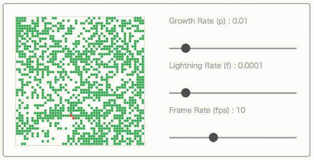

Forest-Fire Model in Elm ([Try It](https://y-taka-23.github.io/elm-forestfire/))
========================

A forest-fire model as a probabilistic cellular automaton.



Transition Rules
----------------

1. A burning tree becomes a empty site
1. A green tree becomes a burning tree if at least one of its nearest neighbors is burning.
1. At an empty site a tree grows with probability _p_.
1. A tree without a burning nearest neighbor becomes a burning tree with probability _f_.

Run Things Locally
------------------

```bash
git clone https://github.com/y-taka-23/elm-forestfire.git
cd elm-forestfire
npm install
elm-package install
npm run start
```

References
----------

* Bak, P., Chen, K. and Tang, C. (1990), "A forest-fire model and some thoughts on turbulence." _Phys. Lett. A_ __147__, pp.297–300.
* Drossel, B. and Schwabl, F. (1992), "Self-organized critical forest-fire model." _Phys. Rev. Lett._ __69__, pp.1629–1632.
